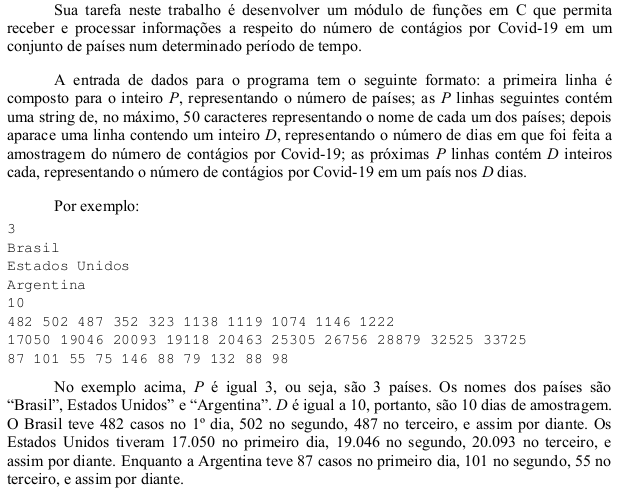
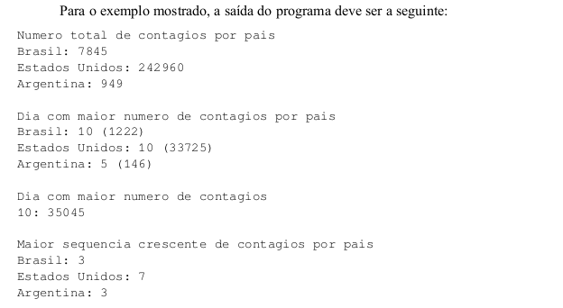

<!-- coivd19 desenvolvido por
Gustavo S. Bacagine e Lucas Pereira de Matos 
Git Hub: https://github.com/Bacagine/LP-Trab01-2020-1 -->

# **Covid19**

Aplicação criada como 1º Trabalho do 1º Semestre do curso de 
Análise e Desenvol-

vimento de Sistemas (ADS)
da FATEC para aula de Programação do professor

Ciro Cirne Trindade [(site do Professor Ciro)](https://sites.google.com/site/ciroct/home)

covid19 é uma aplicação que recebe e processa informações a respeito do numero de contagios por Covid-19 em um conjunto de paises num determinado periodo de tempo.

# Entrada

# Saída

## **Desenvolvedores**
Gustavo Bacagine <gustavo.bacagine@protonmail.com>

Lucas Pereira de Matos <lucas.pereira.matos.000@gmail.com>

Caio Elias Emerick Regino <caioregino.147@gmail.com>
